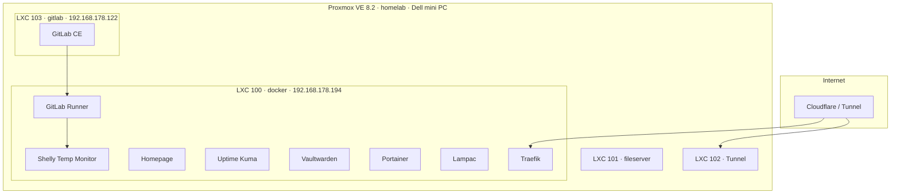

# Homelab

Self-hosted infrastructure on Proxmox VE — Docker, GitLab CI/CD, DevOps portfolio.

**Domain:** `kolyachaba.top`  
**GitHub:** [k4bnv/homelab](https://github.com/k4bnv/homelab)

## Architecture



## Hardware

| Component | Spec |
|-----------|------|
| **Host** | Dell mini PC (OptiPlex Micro class) |
| **CPU** | Intel i5-7500T · 4 cores |
| **RAM** | 2×4 GB DDR4 SO-DIMM (upgrade to 32 GB planned) |
| **Hypervisor** | Proxmox VE 8.2 |
| **Storage** | local-lvm, hdd, local |

## LXC Containers

| ID | Name | IP | Purpose |
|----|------|-----|---------|
| 100 | docker | 192.168.178.194 | Docker services + GitLab Runner |
| 101 | fileserver | — | File storage |
| 102 | Tunnel | — | Cloudflare Tunnel (external access) |
| 103 | gitlab | 192.168.178.122 | GitLab CE + CI/CD |

## Services (LXC 100 · docker)

| Service | Purpose | URL |
|---------|---------|-----|
| [Homepage](homepage/) | Dashboard for all services | https://home.kolyachaba.top |
| [Uptime Kuma](uptime-kuma/) | Uptime monitoring + alerts | https://status.kolyachaba.top |
| [Vaultwarden](vaultwarden/) | Password manager | https://vault.kolyachaba.top |
| [Portainer](portainer/) | Container management | https://portainer.kolyachaba.top |
| [Traefik](traefik/) | Reverse proxy + TLS | https://traefik.kolyachaba.top |
| [Lampac](lampac/) | Media streaming | http://192.168.178.194:9118 |
| [Shelly Temp Monitor](https://github.com/k4bnv/shelly-temp-monitor) | IoT webhook + email alerts | https://temp.kolyachaba.top |
| GitLab CE | Source control + CI/CD | https://gitlab.kolyachaba.top |

## CI/CD

GitLab Runner on LXC 100 (docker executor, host Docker socket):

```
git push → test (pytest) → build (docker build) → deploy (docker compose up)
```

Pet project: [shelly-temp-monitor](https://github.com/k4bnv/shelly-temp-monitor) — Shelly temperature sensor webhook with email alerts.

## Quick Start

```bash
# On LXC 100 (docker)
git clone https://github.com/k4bnv/homelab.git
cd homelab
chmod +x scripts/deploy.sh
./scripts/deploy.sh
```

Or deploy manually:

```bash
docker network create frontend

cd homepage && docker compose up -d
cd ../uptime-kuma && docker compose up -d
cp vaultwarden/.env.example vaultwarden/.env   # edit first
cd ../vaultwarden && docker compose up -d
```

## Uptime Kuma — monitors

| Name | URL |
|------|-----|
| Homepage | https://home.kolyachaba.top |
| Portainer | https://portainer.kolyachaba.top |
| Vaultwarden | https://vault.kolyachaba.top |
| Shelly Monitor | https://temp.kolyachaba.top |
| GitLab | https://gitlab.kolyachaba.top |
| Traefik | https://traefik.kolyachaba.top |
| Lampac | http://192.168.178.194:9118 |

## Repo Structure

```
homelab/
├── homepage/          # Dashboard
├── uptime-kuma/       # Monitoring
├── vaultwarden/       # Passwords
├── portainer/         # Container UI
├── lampac/            # Media
├── traefik/           # Reverse proxy + TLS
├── scripts/deploy.sh
└── README.md
```

## Roadmap

- [x] Proxmox + Docker LXC
- [x] Homepage, Uptime Kuma, Vaultwarden
- [x] GitLab CE (LXC 103)
- [x] GitLab Runner + CI/CD pipeline
- [x] Pet project: shelly-temp-monitor
- [x] Traefik reverse proxy + HTTPS (`*.kolyachaba.top`) — [GUIDE.md](traefik/GUIDE.md)
- [ ] Prometheus + Grafana
- [ ] RAM upgrade (2×16 GB SO-DIMM)
- [ ] k3s migration

## Related Repos

- [shelly-temp-monitor](https://github.com/k4bnv/shelly-temp-monitor) — FastAPI + GitLab CI/CD pet project
