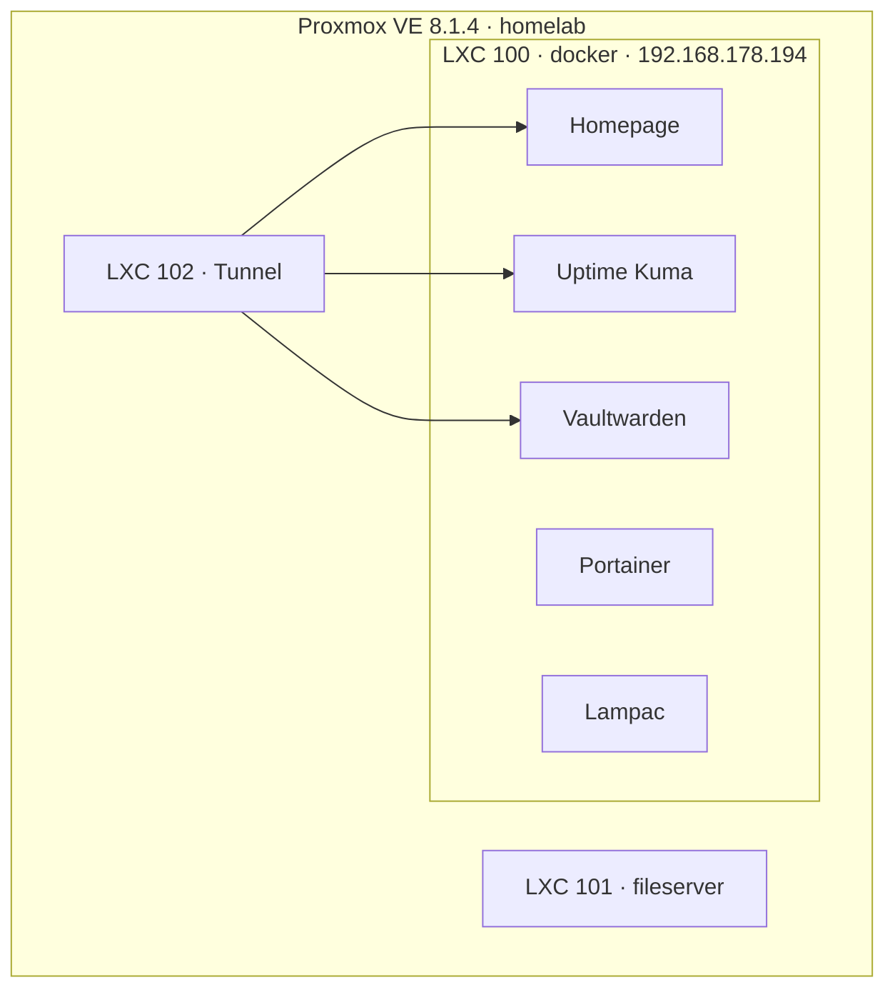

# Homelab

Self-hosted infrastructure on Proxmox VE with Docker.

## Architecture



## Services

| Service | Purpose | URL |
|---------|---------|-----|
| [Homepage](homepage/) | Dashboard for all services | http://192.168.178.194:3000 |
| [Uptime Kuma](uptime-kuma/) | Uptime monitoring + alerts | http://192.168.178.194:3001 |
| [Vaultwarden](vaultwarden/) | Password manager (Bitwarden-compatible) | http://192.168.178.194:8080 |
| [Portainer](portainer/) | Container management | https://192.168.178.194:9443 |
| [Lampac](lampac/) | Media streaming | http://192.168.178.194:9118 |

## Quick Start

```bash
# On LXC 100 (docker)
git clone https://github.com/YOUR_USERNAME/homelab.git
cd homelab
chmod +x scripts/deploy.sh
./scripts/deploy.sh
```

Or deploy manually:

```bash
docker network create frontend

cd homepage && docker compose up -d
cd ../uptime-kuma && docker compose up -d
cp vaultwarden/.env.example vaultwarden/.env   # edit first
cd ../vaultwarden && docker compose up -d
```

## Uptime Kuma — first monitors

After opening http://192.168.178.194:3001, add monitors:

| Name | URL | Type |
|------|-----|------|
| Portainer | https://192.168.178.194:9443 | HTTP(s) |
| Homepage | http://192.168.178.194:3000 | HTTP(s) |
| Vaultwarden | http://192.168.178.194:8080 | HTTP(s) |
| Lampac | http://192.168.178.194:9118 | HTTP(s) |

Optional: Settings → Notifications → Telegram or Discord.

## Vaultwarden — setup

1. Edit `vaultwarden/.env`:
   - `DOMAIN` — your public URL (e.g. `https://vault.kolyachaba.top`) or local IP for now
   - `ADMIN_TOKEN` — random string for admin panel at `/admin`
   - `SIGNUPS_ALLOWED=false` after creating your account
2. Install [Bitwarden app](https://bitwarden.com/download/) or browser extension
3. Settings → Self-hosted → Server URL: `http://192.168.178.194:8080` (or your domain)
4. Create account (first user only if signups enabled)

## Repo Structure

```
homelab/
├── homepage/
│   ├── docker-compose.yaml
│   └── config/
│       ├── settings.yaml
│       ├── services.yaml
│       └── widgets.yaml
├── uptime-kuma/
├── vaultwarden/
│   ├── docker-compose.yaml
│   └── .env.example
├── portainer/
├── lampac/
└── scripts/deploy.sh
```

## Roadmap

- [ ] Traefik reverse proxy + HTTPS (`*.kolyachaba.top`)
- [ ] Prometheus + Grafana monitoring
- [ ] GitLab CE + CI/CD runners
- [ ] k3s migration
